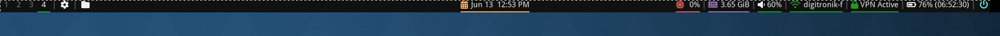

# My Minimalist i3 & Polybar Desktop on Fedora

This repository contains the complete configuration for my minimalist, keyboard-driven i3wm desktop environment running on the Fedora i3 Spin. It features a clean and functional Polybar status bar, custom menus for easy access to settings and power options, and several scripts to enhance usability.




## 1. Installation on Fedora

This guide assumes you are starting with the Fedora i3 Spin or have i3 installed.

1.  **Install All Required Packages**

    First, update your system. Then, install all the necessary applications, utilities, and daemons with a single command.

    ```bash
    sudo dnf copr enable vishalvvr/byzanz
    sudo dnf update

    sudo dnf install i3 polybar dmenu tilix thunar arandr xfce4-screenshooter byzanz zenity pavucontrol brightnessctl feh blueman i3lock python3-pip rofi NetworkManager-tui lxappearance
    ```

2.  **Install Additional Python Package**

    The screencast script requires `python-xrectsel` for selecting screen regions.

    ```bash
    pip install --user python-xrectsel
    ```

3.  **Install Fonts**

    This setup requires two fonts: **Droid Sans** (for text) and **Font Awesome 6** (for icons).

    * **Droid Sans:**
        ```bash
        sudo dnf install google-droid-sans-fonts
        ```
    * **Font Awesome 6 (Crucial for Icons):**
        ```bash
        sudo dnf install fontawesome-fonts
        ```
        Other way you can download and extract from [here](https://fontawesome.com/download).
        ```
        cp -r <.otf files> ~/.local/share/fonts/
        ```
    After installing fonts, rebuild the system's font cache:
    ```bash
    fc-cache -fv
    ```

4.  **Configure Your System**

    * **Backup Your Existing Configs:** Before you begin, back up your current i3 and Polybar configurations if you have any:
        ```bash
        mv ~/.config/i3 ~/.config/i3.bak
        mv ~/.config/polybar ~/.config/polybar.bak
        ```
    * **Copy the New Config Folders:** Place the `i3` and `polybar` folders from this project into your `~/.config/` directory.
        ```bash
        # Assuming the new folders are in your current directory
        cp -r ./i3 ~/.config/
        cp -r ./polybar ~/.config/
        ```
    * **Make All Scripts Executable:** This is a critical step to ensure that all custom functionalities work.
        ```bash
        chmod +x ~/.config/i3/*.sh
        chmod +x ~/.config/polybar/*.sh
        chmod +x ~/.config/polybar/scripts/*.sh
        ```
    * **Set Your Wallpaper:** The i3 config looks for wallpapers in `~/.config/i3/pictures/`. Make sure that directory exists and has at least one image file in it.

5.  **Reload i3**

    Reload your i3 configuration in-place by pressing `$mod+Shift+c`, or simply log out (`$mod+Shift+e`) and log back in to see all the changes and have all startup services running.

---

## 2. Usage & Keybindings

The modifier key is the **Super** key (also known as the Windows key), referred to as `$mod` in the configuration.

| Keybinding | Action |
| :--- | :--- |
| **System Control** | |
| `$mod+Shift+c` | Reload the i3 configuration file. |
| `$mod+Shift+e` | Show a confirmation prompt to log out of i3. |
| `$mod+l` | Lock the screen with `i3lock`. |
| `$mod+Shift+h` | **Immediate** Hibernate (locks screen first). |
| `$mod+Shift+r` | **Immediate** Reboot. |
| `$mod+Shift+s` | **Immediate** Shutdown. |
| **Application Launchers** | |
| `$mod+d` | Launch `dmenu` to run an application. |
| `$mod+Return` or `$mod+t` | Open a new terminal (`tilix`). |
| `$mod+h` | Open the file manager (`thunar`). |
| **Window Management** | |
| `$mod+Shift+q` | Kill the focused window. |
| `$mod` + Arrow Keys | Change window focus. |
| `$mod+Shift` + Arrow Keys | Move the focused window. |
| `$mod+o` / `$mod+v` | Split horizontally / vertically. |
| `$mod+f` | Toggle fullscreen for the focused window. |
| `$mod+s` / `$mod+w` / `$mod+e` | Change layout (stacking / tabbed / toggle split). |
| `$mod+Shift+space` | Toggle floating for the focused window. |
| `$mod+r` | Enter resize mode (use arrow keys to resize). |
| **Scratchpad Terminal** | |
| `$mod+Shift+minus` | Move the focused window to the scratchpad. |
| `$mod+minus` | Show/hide the scratchpad terminal. |
| **Workspaces** | |
| `$mod` + `1-0` | Switch to the corresponding workspace. |
| `$mod+Shift` + `1-0` | Move the focused window to the workspace. |
| **Hardware & Utilities** | |
| `PrintScreen` | Open `xfce4-screenshooter` to take a screenshot. |
| `$mod+PrintScreen` | Start/Stop recording a GIF of the screen. |
| `$mod+m` | Open display settings (`arandr`). |
| `$mod+Shift+v` | Open advanced audio controls (`pavucontrol`). |
| `Volume Up key` (`XF86AudioRaiseVolume`) | Increase system volume by 5%. |
| `Volume Down key` (`XF86AudioLowerVolume`) | Decrease system volume by 5%. |
| `Mute key` (`XF86AudioMute`) | Toggle system audio mute. |
| `Mic Mute key` (`XF86AudioMicMute`) | Toggle microphone mute. |
| `Brightness Up key` (`XF86MonBrightnessUp`) | Increase screen brightness. |
| `Brightness Down key` (`XF86MonBrightnessDown`) | Decrease screen brightness. |

---

## 3. Scripts Overview

This setup uses several custom scripts to add functionality.

* `~/.config/i3/battery_notify.sh`: Runs in the background to provide system notifications when the battery is low or fully charged.
* `~/.config/i3/screencast.sh`: A tool to record parts of the screen as a GIF, perfect for quick demos.
* `~/.config/i3/lock.sh`: A helper script called by the power menu to handle locking, suspending, and other power actions.
* `~/.config/polybar/settings.sh`: Creates the `zenity`-based pop-up menu for system settings, accessible by clicking the gear icon on Polybar.
* `~/.config/polybar/powermenu.sh`: Creates the `zenity`-based pop-up menu for power options, accessible by clicking the power icon on Polybar.
* `~/.config/polybar/scripts/check-vpn.sh`: Intelligently checks for an active VPN connection and updates the Polybar module, showing a connected or disconnected status without errors.

---
