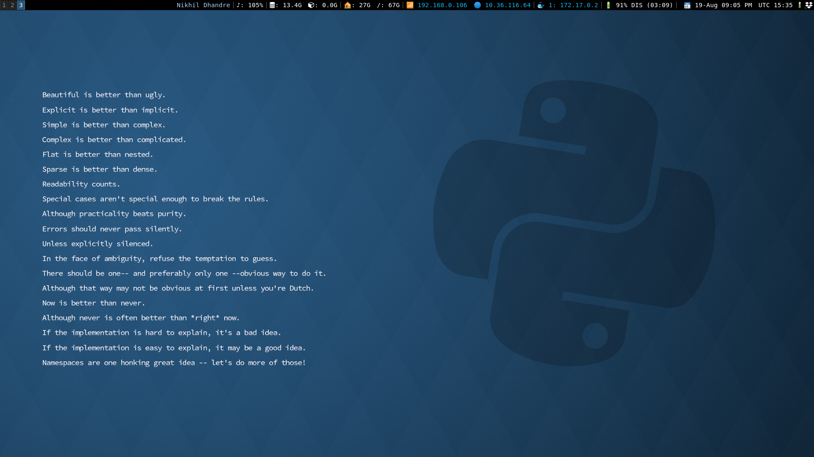

# **i3 and i3blocks**
*My i3 configuration files.*

I am a Fedora user. I like to use `minimal`, `light weight OS` and `softwares`. I choose [Fedora-Xfce](https://spins.fedoraproject.org/xfce/) as my operating system. The Fedora Xfce spin showcases the `Xfce` desktop, which aims to be `fast` and `lightweight`.

I was not happy with it. I like more `customization` having my own `shortcuts`, `blocks` giving me `system information`, about `storage`, `networks`, `IPs` including my running `Docker container IPs`, `easy window management` and all those with keys :D.

While `resizing` or `moving` `windows`; I don't like to use a `mouse`. I like to `shuffle` all those `window containers` with my `key-binding`.

So, I adopted [i3](https://i3wm.org/) as my `Windows Manager` but, `simple bar` :(. I don't like it. I want more `customization` so, I am using [i3bloks](https://github.com/vivien/i3blocks).


How's my laptop `top-bar` looks?


My `desktop` look...


## Installation:
As `Fedora` user; I am building this as per `Fedora-Xfce` :D. you have to find your own ways. `Google baba` is there.

- i3 install
```
sudo dnf install i3
```

- `Logout` and `Login` with `i3` `windows manager`. Create `default` `configuration` files.

- clone repo in temp dir
```
cd /tmp/
git clone https://github.com/digitronik/i3.git
cd i3
```

- Run `quickstart.sh` for installing `i3bloks` remove some unwanted files and move `configuration` files. 
```
sudo chmod +x quickstart.sh
./quickstart.sh
```

- Some `lightweight` software; I used with `fedora-xfce`. If you like you can use.
```
sudo chmod +x requirnments.sh
./requirnments.sh
```

- Edit your `i3` files as per `requirements` and `softwares` available with your system.
```
vi ~/.config/i3/config
```