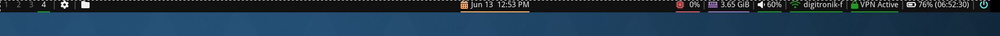

# My Minimalist i3 & Polybar Desktop on Fedora

This repository contains the complete configuration for my minimalist, keyboard-driven i3wm desktop environment running on the Fedora i3 Spin. It features a clean and functional Polybar status bar, custom menus for easy access to settings and power options, and several scripts to enhance usability.




## 1. Installation on Fedora

This guide assumes you are starting with the Fedora i3 Spin or have i3 installed.

1.  **Install All Required Packages**

    First, update your system. Then, install all the necessary applications, utilities, and daemons with a single command.

    ```bash
    sudo dnf copr enable vishalvvr/byzanz
    sudo dnf update

    sudo dnf install i3 polybar dmenu tilix thunar arandr xfce4-screenshooter byzanz zenity pavucontrol brightnessctl feh blueman i3lock python3-pip rofi NetworkManager-tui lxappearance
    ```

2.  **Install Additional Python Package**

    The screencast script requires `python-xrectsel` for selecting screen regions.

    ```bash
    pip install --user python-xrectsel
    ```

3.  **Install Fonts**

    This setup requires two fonts: **Droid Sans** (for text) and **Font Awesome 6** (for icons in Polybar). Both are included in the `fonts/` directory of this repository for convenience.

    ```bash
    mkdir -p ~/.local/share/fonts
    cp -r ./fonts/droid-sans/. ~/.local/share/fonts/
    cp -r ./fonts/font-awesome/. ~/.local/share/fonts/
    fc-cache -fv
    ```

    Alternatively, install via package manager:

    * **Droid Sans:**
        ```bash
        sudo dnf install google-droid-sans-fonts
        ```
    * **Font Awesome 6:**
        ```bash
        sudo dnf install fontawesome-fonts
        ```

4.  **Configure Your System**

    * **Backup Your Existing Configs:**
        ```bash
        mv ~/.config/i3 ~/.config/i3.bak
        mv ~/.config/polybar ~/.config/polybar.bak
        ```
    * **Copy the New Config Folders:**
        ```bash
        cp -r ./i3 ~/.config/
        cp -r ./polybar ~/.config/
        ```
    * **Make All Scripts Executable:**
        ```bash
        chmod +x ~/.config/i3/*.sh
        chmod +x ~/.config/polybar/*.sh
        ```
    * **Set Your Wallpaper:** The i3 config looks for wallpapers in `~/.config/i3/pictures/`. Make sure that directory exists and has at least one image file in it. On every i3 reload, a random image from that folder will be set as the wallpaper.

5.  **Reload i3**

    Reload your i3 configuration in-place by pressing `$mod+Shift+c`, or log out (`$mod+Shift+e`) and back in to have all startup services running.

---

## 2. Usage & Keybindings

The modifier key is the **Super** key (Windows key), referred to as `$mod`.

| Keybinding | Action |
| :--- | :--- |
| **System Control** | |
| `$mod+Shift+c` | Reload the i3 configuration file. |
| `$mod+Shift+e` | Show a confirmation prompt to log out of i3. |
| `$mod+l` | Lock the screen. |
| `$mod+Shift+h` | Hibernate (locks screen first). |
| `$mod+Shift+r` | Reboot. |
| `$mod+Shift+s` | Shutdown. |
| **Application Launchers** | |
| `$mod+d` | Launch `dmenu` to run an application. |
| `$mod+Return` or `$mod+t` | Open a new terminal (`tilix`). |
| `$mod+h` | Open the file manager (`thunar`). |
| **Window Management** | |
| `$mod+Shift+q` | Kill the focused window. |
| `$mod` + Arrow Keys | Change window focus. |
| `$mod+Shift` + Arrow Keys | Move the focused window. |
| `$mod+o` / `$mod+v` | Split horizontally / vertically. |
| `$mod+f` | Toggle fullscreen for the focused window. |
| `$mod+s` / `$mod+w` / `$mod+e` | Change layout (stacking / tabbed / toggle split). |
| `$mod+Shift+space` | Toggle floating for the focused window. |
| `$mod+r` | Enter resize mode (use arrow keys to resize). |
| **Scratchpad** | |
| `$mod+Shift+minus` | Move the focused window to the scratchpad. |
| `$mod+minus` | Show/hide the scratchpad window. |
| **Workspaces** | |
| `$mod` + `1-0` | Switch to the corresponding workspace (1–10). |
| `$mod+Shift` + `1-0` | Move the focused window to that workspace. |
| **Hardware & Utilities** | |
| `PrintScreen` | Open `xfce4-screenshooter` for a screenshot. |
| `$mod+PrintScreen` | Start/Stop recording a screen region as a GIF. |
| `$mod+m` | Open display settings (`arandr`). |
| `$mod+Shift+v` | Open advanced audio controls (`pavucontrol`). |
| `Volume Up / Down` | Increase / decrease system volume by 5%. |
| `Mute` | Toggle system audio mute. |
| `Mic Mute` | Toggle microphone mute. |
| `Brightness Up / Down` | Increase / decrease screen brightness. |

---

## 3. Scripts Overview

| Script | Description |
| :--- | :--- |
| `i3/lock.sh` | Central handler for all power and session actions (lock, logout, suspend, hibernate, reboot, shutdown). Called by both the Polybar power menu and i3 keybindings. |
| `i3/battery_notify.sh` | Runs in the background to send desktop notifications when battery is low (≤20%) or fully charged (≥98%). Uses a PID file to ensure only one instance runs at a time. |
| `i3/screencast.sh` | Records a selected screen region as a GIF using `byzanz` and `xrectsel`. Toggle start/stop with `$mod+PrintScreen`. Tracks the recorder PID directly so stopping is precise and doesn't affect other processes. |
| `polybar/launch.sh` | Kills any running Polybar/i3bar instances and starts Polybar fresh. Called on every i3 reload via `exec_always`. |
| `polybar/bluetooth.sh` | Displays Bluetooth status (on/off/connected device) in Polybar. Left-click toggles power; right-click opens `blueman-manager`. Includes a fix for the bluetoothctl startup race condition. |
| `polybar/check-vpn.sh` | Checks for an active VPN connection (via `tun0` interface) and updates the Polybar VPN module with a green "Active" or red "Down" indicator. |
| `polybar/powermenu.sh` | Displays a `zenity` pop-up power menu. Accessible by clicking the power icon in Polybar. |
| `polybar/settings.sh` | Displays a `zenity` pop-up settings menu with quick access to audio, display, network, and config files. Accessible by clicking the gear icon in Polybar. |

---
